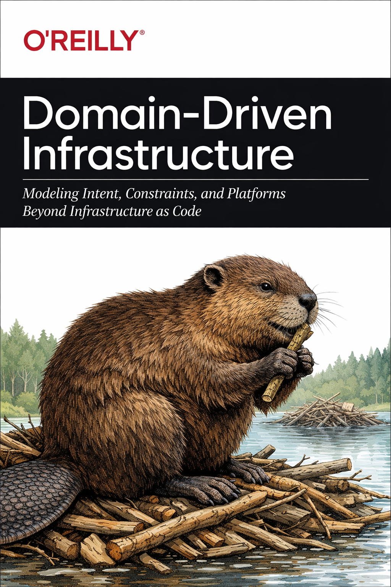
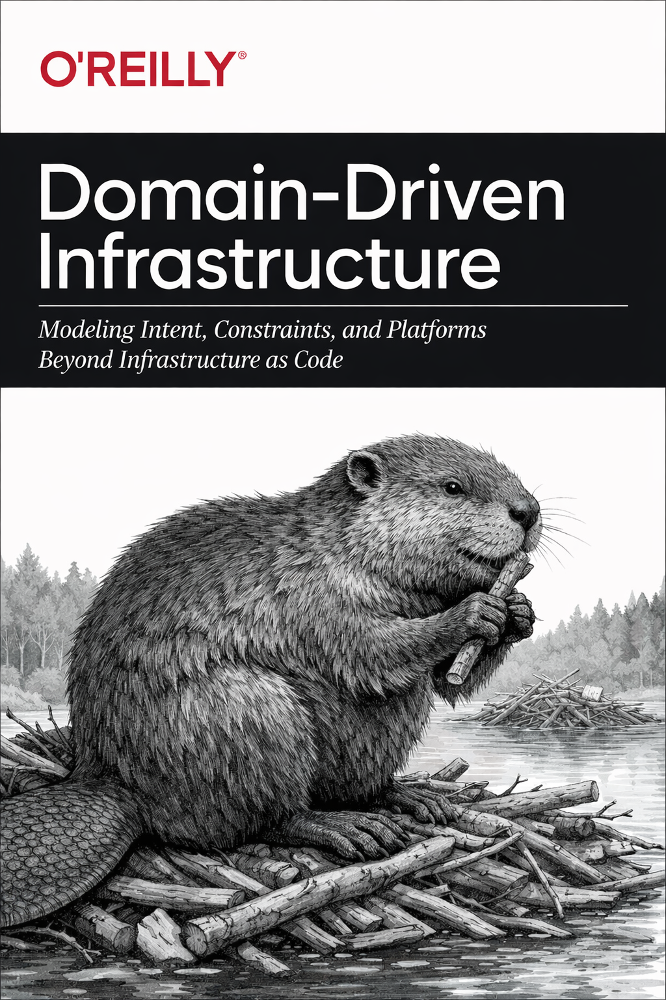

# Domain-Driven Infrastructure

**Proposed animal:** Beaver  
**Audience:** Platform engineers, infrastructure architects, internal platform teams  
**Thesis:** Applying DDD principles to infrastructure to model intent, constraints, and policy before provisioning.  
**Why missing:** No existing book explores infrastructure as a decision system under domain-driven modeling.  
**Sample back cover text:**

> Infrastructure has learned how to reproduce itself. It has not learned how to explain itself...
> **Links / references:**

- Talks on platform engineering & internal APIs
- Articles about DDD applied to cloud
